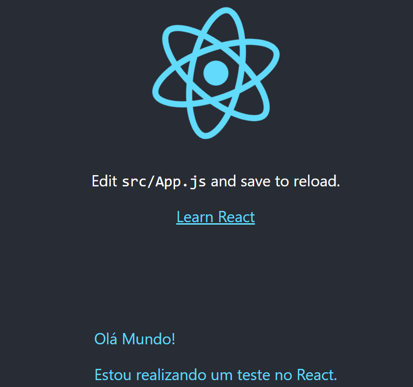

<h1>Como iniciar um projeto React</h1>

Para iniciar um projeto React, basta instalar o Node.js e o npm, após, devemos usar o comando no terminar <code>npm install -g create-react-app</code>, para instalar de forma global.

Em seguida usamos o comando <code>npx create-react-app 'nome-da-pasta'</code>, para criar uma pasta que vai conter os arquivos para nosso programa React.  Caso já tenha criado uma pasta, basta estar no endereço da pasta do programa e usar o comando "npx create-react-app", seguido por um ponto (.), <code>"npx create-react-app ."</code>.

Após criarmos e configurarmos o ambiente pelo comando "npx create-react-app .", esse comando é usado para que o React prepare todo o ambiente de desenvolvimento, configurando o webpach e o Babel. Como React usa comandos <code>jsx</code>, como exemplo <code>const element = &#60;h1&#62;Hello, world!&#60;/h1&#62;;</code>, que não é lido pelo navegador, é necessário o uso do Babel, que pega o código jsx e converte em js, que é compreensivo pelo navegador. Além de gerar arquivos que contem uma pequena página dos desenvolverores React, que direciona para a página da documentação React. 
Esses arquivos são js, css, html e imagens que são usadas para gerar o programa, além de conter um arquivo de teste e outro com os comandos React para iniciar o programa, testar, realizar build, e eject.

<h2>Comando start</h2>

No React temos o comando <code>npm start</code>, onde será abreto o navedador e iniciado o nosso programa em React, qualquer alteração realizada basta salvar o arquivo que a página será atualizada.
<h2>Comando test</h2>

Como o programa gerado possue um arquivo para teste, "App.teste.js", ao rodar o comando <code>npm run test</code>, no terminal será realizado um teste e informa quantos testes foram feitos, quantos testes tiveram sucesso o tempo e quantos deram erro.
<pre>Test Suites: 1 passed, 1 total
Tests:       1 passed, 1 total
Snapshots:   0 total
Time:        2.375 s</pre>

<h2>Comando build</h2>

Comando usado quanod fazer deply do projeto, esse comadno cria um arquivo minificado para ser hospedado no servidor, são todos os arquivos css, html, js e img, usados de forma minificada, sem espaços e até palavras redusidas.

<h2>Onde usar o React</h2>

O react é geralmente usadao na página toda, como pro exemplo em uma 'div', com id ou class especifico, onde será usado para gerar todos os scripts atravez da importação do ReactDOM, em um arquivo 'index.js', que vai renderisar o conteudo na div. Ou o React pode ser usado em locias específicos da página, como um menu, uma section, etc e adicionar o restante dos elementos do site, seja HTML, CSS ou JavaScript puro, no arquivo 'index.html'.

<ul>
  <li>Inserindo React em uma única div
  <pre>
    //Arquivo index.js
    import React from 'react';
    import ReactDOM from 'react-dom/client';
    import './index.css';
    import App from './App';
    import Mydiv from './minhaDiv';
    import reportWebVitals from './reportWebVitals';
    const root = ReactDOM.createRoot(document.getElementById('root'));
    root.render(
      &#60;React.StrictMode&#62;
        &#60;App /&#62;
        &#60;Mydiv /&#62;
      &#60;/React.StrictMode&#62;
    );

    //Arquivo index.html
    &#60;body&#62;
      &#60;noscript>You need to enable JavaScript to run this app.&#60;/noscript&#62;
      &#60;div id="root"&#62;&#60;/div&#62;
    ...
  </pre>

  </li>
  <li>Inserindo React em mais de uma div da página:<pre>
      //Arquivo index.js
      import React from 'react';
      import ReactDOM from 'react-dom/client';
      import './index.css';
      import App from './App';
      import Mydiv from './minhaDiv';
      import reportWebVitals from './reportWebVitals';

      const tst = ReactDOM.createRoot(document.querySelector('.minhaDiv'));
      tst.render(
        <React.StrictMode>
          <Mydiv />
        </React.StrictMode>
      );

      const root = ReactDOM.createRoot(document.getElementById('root'));
      root.render(
        <React.StrictMode>
          <App />
        </React.StrictMode>
      );

      //Arquivo index.html
      <body>
        <noscript>You need to enable JavaScript to run this app.</noscript>;
        

;
        

;
      ...
  </pre>
  </li>
</ul>

  O resultado nos dois casos será:
  

