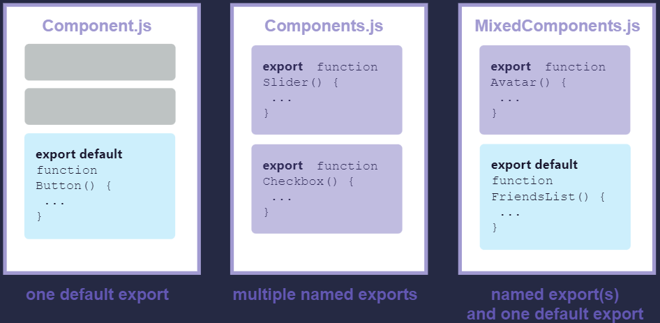

<h1>O que são componentes no React</h1>

Como visto antes, aplicações React são construídas a partir de partes isoladas da UI chamadas de componentes. Um componente React é uma função JavaScript que permite você adicionar tags HTML. Os componentes podem ser tão pequenos quanto um botão ou tão grandes quanto uma página inteira. 
Como nesse exemplo, arquivo 'saudacao.js':
<pre>
import './App.css';

function Saudacao(){
  return(
    &#60;div className="saudacao">;
      &#60;p>Olá Mundo!&#60;/p>
      &#60;p>Estou realizando um teste no React.&#60;/p>
    &#60;/div>
  );
}
export default Saudacao()
</pre>
<ol>
  <li>import './App.css';
    
Usado para importar a estilização que está no arquivo 'App.css', para o elemento '&#60;div className="minhaDiv">'

  </li>
  <li>function Saudacao(){ }
    
Essa sintaxe é usada para definir a função chamada 'Saudacao', que retorna os elementos HTML que serão renderizados.

  </li>
  <li>&#60;div className="saudacao">; e demais elementos HTML
    
O componente React, 'Saudacao', retorna uma tag <code>&#60;div>&#60;/div></code> e suas tags filhas <code>&#60;p>&#60;/p></code>, que escritos como HTML, mas na verdade, é o JavaScript que está por trás! Essa sintaxe é chamada JSX e permite usar tags HTML dentro do JavaScript.

  </li>
  <li>export default
    
O prefixo export default é uma sintaxe padrão do JavaScript (não específica do React). Ele permite que você marque a função principal em um arquivo para que você possa mais tarde importá-la de outros arquivos.

  </li>
</ol>

OBS: Os componentes do React são funções comuns do JavaScript, mas seus nomes devem começar com letra maiúscula ou não funcionarão

<pre>
  //Arquivo index.html
    &#60;body>
      &#60;div class="saudacao">&#60;/div>
    ...
__________________________________
  //Arquivo index.js
  import React from 'react';
  import ReactDOM from 'react-dom/client';
  import './index.css';
  import Saudacao from './Saudacao';
  import reportWebVitals from './reportWebVitals';

  const txt = ReactDOM.createRoot(document.querySelector('.saudacao'));
  txt.render(
    &#60;React.StrictMode>
      &#60;Saudacao />
    &#60;/React.StrictMode>
  );
  reportWebVitals();
</pre>

No exemplo acima nosso componente 'Saudacao' é renderizado no arquivo <code>index.html</code> na <code>div class="saudacao"</code> através do arquivo <code>index.js</code>

OBS: Componentes podem renderizar outros componentes, mas você nunca deve definir um componente dentro de outro componente
  <pre>export default function Gallery() {
    // 🔴 Nunca defina um componente dentro de outro componente!
    function Profile() {
      // ...
    }
    // ...
  }</pre>
  O trecho acima é muito lento e causa erros. Em vez disso, defina todos os componentes no nível superior:
  <pre>export default function Gallery() {
    // ...
  }

  // ✅ Declare componentes no nível superior
  function Profile() {
    // ...
  }</pre>
  Quando um componente filho precisa de alguns dados de um pai, passe-os por 'props', queserá visto na aula 04, em vez de definições de aninhamento.

Além dos componentes de função, no React também usandos os <code>componentes de classe</code>, que são componentes que possuem um alto nível de poder dentro da aplicação, pois além de gerenciar o próprio estado, herdam os chamados métodos de clico de vida do React, lidam com partes lógicas da aplicação e manipulam eventos através de métodos que podem ser invocados em qualquer lugar do componente ou em seus filhos. Eles são mais comlexos e oferecem mais funcionalidade em comparação com componentes de função.
Para definir um <code>class component</code>, a classe precisa estender React.Component
<pre>
class Welcome extends React.Component {
  render() {
    return &#60;h1>Olá, {this.props.name}&#60;/h1>;
  }
}
</pre>
O método <code>render()</code> é obrigatório em um componente de classe, sendo responsável por descrever o que será exibido na tela, ele retorna o código JSX, ele não recebe nenum argumento e é chamado automaticamente pelo React.Embora o método <code>render()</code> seja chamado, isso não significa necessariamente que o DOM será atualizado. O React usa um processo chamado reconciliação para determinar quais partes do DOM precisam ser alteradas.

<h2>Importando e Exportando Componentes</h2>

Como visto os componentes React podem ser criados no mesmo arquivo raiz, como exemplo <code>App.js</code>, mas isso é mais viável quando nosso sistema é pequeno e não temos muitos componentes para serem criados.

Muitos componentes criados em um núnico arquivo vai dificultar na manutenção e na leitura docódigo. Dessa forma podemos separar os componentes em cada arquivo, exporta-los e importa-los no arquivo raiz.

No exemplo a seguir nossos componentes, <code>Gallery()</code> e <code>Profile()</code> estão em uma arquivo raiz chamado <code>App.js</code>.

<pre>
  function Profile() {
  return (
    &#60;img
      src="https://i.imgur.com/MK3eW3As.jpg"
      alt="Katherine Johnson"
    />
  );
}
export default function Gallery() {
  return (
    &#60;section>
      &#60;h1>Amazing scientists</h1>
      &#60;Profile />
      &#60;Profile />
      &#60;Profile />
    &#60;/section>
  );
}
</pre>

Faz sentido mover <code>Gallery()</code> e <code>Profile()</code> do arquivo do componente raiz. Isso os tornará mais modulares e reutilizáveis ​​em outros arquivos. Para isso devemos seguir três etapas:

<ul>
  <li>Crie um novo arquivo JS para colocar os componentes.</li>
  <li>Exporte seu componente de função desse arquivo (usando exportações padrão ou nomeadas).</li>
  <li>Importe-o no arquivo onde você usará o componente (usando a técnica correspondente para importar exportações padrão ou nomeadas).</li>
</ul>

Aqui ambos Profile foram Gallery movidos App.js para um novo arquivo chamado Gallery.js. Agora você pode mudar App.js para importar Gallery de Gallery.js:

<pre>Arquivo App.js
import Gallery from './Gallery.js';
export default function App() {
  return (
    <>
      &#60;Gallery />
      &#60;Gallery />
    &#60;/>
  );
}</pre>
<pre>Arquivo Gallery.js
  function Profile() {
  return (
    &#60;img
      src="https://i.imgur.com/MK3eW3As.jpg"
      alt="Katherine Johnson"
    />
  );
}
export default function Gallery() {
  return (
    &#60;section>
      &#60;h1>Amazing scientists</h1>
      &#60;Profile />
      &#60;Profile />
      &#60;Profile />
    &#60;/section>
  );
}</pre>

Observe como este exemplo está dividido em dois arquivos componentes agora:
  <ol>
    <li>Gallery.js:
      <ul>
        <li>Define o Profilecomponente que só é usado dentro do mesmo arquivo e não é exportado.</li>
        <li>Exporta o Gallerycomponente como uma exportação padrão.</li>
      </ul>
    </li>
    <li>App.js:
      <ul>
        <li>Importa Gallerycomo uma importação padrão do Gallery.js.</li>
        <li>Exporta o Appcomponente raiz como uma exportação padrão.</li>
      </ul>
    </li>
  </ol>

<h3>Exportações padrão vs nomeadas</h3>

Existem duas maneiras principais de exportar valores com JavaScript: exportações padrão e exportações nomeadas. Até agora, nossos exemplos usaram apenas exportações padrão. Mas você pode usar um ou ambos no mesmo arquivo. Um arquivo não pode ter mais de uma exportação padrão , mas pode ter quantas exportações nomeadas desejar.

A forma como você exporta seu componente determina como você deve importá-lo. Você receberá um erro se tentar importar uma exportação padrão da mesma forma que faria com uma exportação nomeada! Este gráfico pode ajudá-lo a acompanhar:

Ao escrever uma importação padrão , você pode colocar qualquer nome que desejar depois de <code>import</code>. Por exemplo, você poderia escrever <code>import Banana from './Button.js</code> em vez disso e ainda forneceria a mesma exportação padrão. Em contraste, com importações nomeadas, o nome tem de corresponder em ambos os lados. É por isso que são chamadas de importações nomeadas!

As pessoas costumam usar exportações padrão se o arquivo exportar apenas um componente e usar exportações nomeadas se exportar vários componentes e valores. Independentemente do estilo de codificação de sua preferência, sempre dê nomes significativos às funções dos componentes e aos arquivos que os contêm. Componentes sem nomes, como export default () => {}, são desencorajados porque dificultam a depuração.

<h3>Exportando e importando vários componentes do mesmo arquivo</h3>

Ainda usando como exemplo o nosso componente <code>Profile</code> no arquivo <code>Galerry.js</code>, se quisermos mostrar apenas um <code>Profile</code> em vez de uma galeria. Mas <code>Galerry.js</code> já possui uma exportação padrão e você não pode ter duas exportações padrão. Você pode criar um novo arquivo com uma exportação padrão ou adicionar uma exportação nomeada para <code>Profile</code>. Um arquivo pode ter apenas uma exportação padrão, mas pode ter inúmeras exportações nomeadas!

Primeiro, exporte <code>Profile</code> usando <code>Galerry.js</code> uma exportação nomeada (sem a palavra-chave <code>default</code>):
<pre>export function Profile() {
  // ...
}</pre>
Em seguida, importe <code>Profile</code> de <code>Galerry.js</code> para <code>App.js</code> usando uma importação nomeada (com chaves):
<pre>import { Profile } from './Gallery.js';</pre>
Finalmente, renderize <code>&#60;Profile /></code> a partir do App componente:
<pre>export default function App() {
  return &#60;Profile />;
}</pre>
Agora <code>Galerry.js</code> contém duas exportações: uma <code>Galerry</code> exportação padrão e uma <code>Profile</code> exportação nomeada. <code>App.js</code> importa ambos.

<pre>
  Arquivo App.js
    import Gallery from './Gallery.js';
    import { Profile } from './Profile.js';
    export default function App() {
      return (
        &#60;Profile />
      );
    }
</pre>
<pre>
Arquivo Galerry.js
  export function Profile() {
    return (
      &#60;img
        src="https://i.imgur.com/QIrZWGIs.jpg"
        alt="Alan L. Hart"
      />
    );
  }
  export default function Gallery() {
    return (
      &#60;section>
        &#60;h1>Amazing scientists&#60;/h1>
        &#60;Profile />
        &#60;Profile />
        &#60;Profile />
      &#60;/section>
    );
  }
</pre>
Agora você está usando uma combinação de exportações padrão e nomeadas:
<ol>
  <li>Galerry.js
    <ul>
      <li>Exporta o Profile componente como uma exportação nomeada chamada Profile.</li>
      <li>Exporta o Gallerycomponente como uma exportação padrão.</li>
    </ul>
  </li>
  <li>App.js
    <ul>
      <li>Importa Profile como uma importação nomeada chamada Profile from Gallery.js.</li>
      <li>Importa Gallery como uma importação padrão do Gallery.js.</li>
      <li>Exporta o App componente raiz como uma exportação padrão.</li>
    </ul>
  </li>
</ol>

Mas para ficar menos confuso podemos separar Profile de Galerry, mantendo o Galery como exportação padrão e o Profile como nomeada:
<pre>
  Arquivo App.js
    import Gallery from './Gallery.js';
    import { Profile } from './Profile.js';
    export default function App() {
      return (
        <>
          &#60;Galerry />
          &#60;Profile />
        &#60;/>
      );
    }
</pre>
<pre>
Arquivo Galerry.js
  export default function Gallery() {
    return (
      &#60;section>
        &#60;h1>Amazing scientists&#60;/h1>
      &#60;/section>
    );
  }
</pre>
<pre>
  Arquivo Profille
    export function Profile() {
      return (
        &#60;img
          src="https://i.imgur.com/QIrZWGIs.jpg"
          alt="Alan L. Hart"
        />
      );
    }
</pre>

